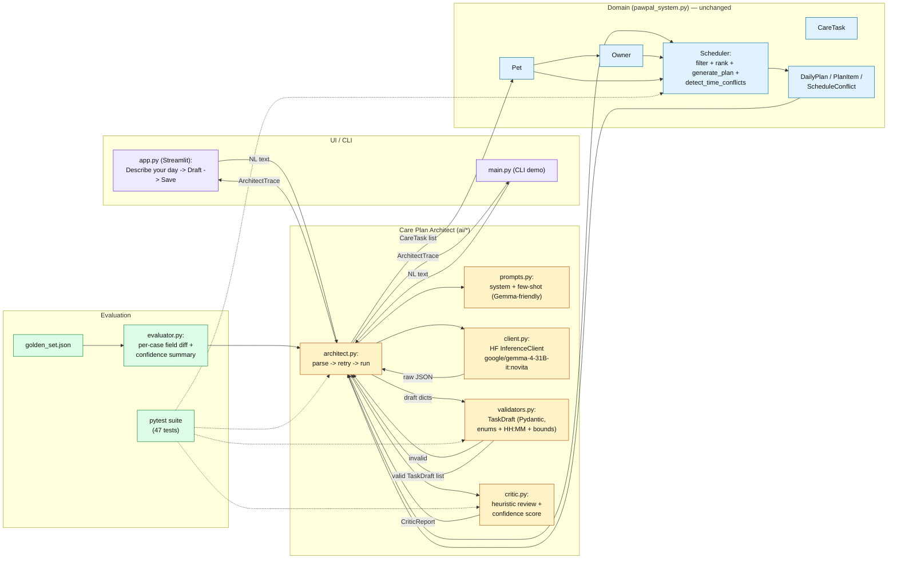

# PawPal+ Care Plan Architect

> **Capstone project — Applied AI System.**
> Extends the Module 2 PawPal+ scheduler with a natural-language AI intake
> layer. Owners describe their day in plain English; the system extracts
> validated care tasks, builds a schedule on the original PawPal+ scheduler,
> and runs a self-critique with a confidence score.

## Base project

This repository extends **PawPal+ (Module 2)**, a Streamlit + Python
pet-care scheduler built around four classes (`Owner`, `Pet`, `CareTask`,
`Scheduler`) that rank feasible tasks, generate a daily plan under owner
time constraints, and warn on overlapping intervals. That base system is
preserved untouched in `pawpal_system.py`; the capstone adds a new `ai/`
package in front of it.

See `reflection.md` for the capstone design journey (phases, tradeoffs,
testing strategy) and `model_card.md` for model-level scope, limits, and
misuse mitigations.

## What the capstone adds

- A **Care Plan Architect** (`ai/architect.py`) that converts free-text
  owner input into `TaskDraft` objects using `google/gemma-4-31B-it:novita`
  via the Hugging Face Inference API.
- **Pydantic validation** (`ai/validators.py`) so malformed drafts never
  reach the scheduler.
- A **repair-retry loop** — if the first LLM response is bad JSON or fails
  validation, the architect re-prompts with the parser's error message.
- A **deterministic critic** (`ai/critic.py`) that scores confidence (0–1)
  and flags coverage issues, implausible durations, unscheduled tasks, and
  time conflicts.
- A **human-in-the-loop save flow** in Streamlit: per-draft checkboxes let
  the owner approve or discard each AI-generated task before it commits to
  their pet.
- A **golden-set evaluator** (`ai/evaluator.py`) that runs 6 NL scenarios
  end-to-end and prints per-case field accuracy + confidence stats.
- **`.env` based config** so `HF_TOKEN` lives in an ignored file, not in the
  shell history or source.

The core `pawpal_system.py` — every class, every method, every test — is
unchanged. The AI layer is strictly additive.

## Architecture



The same diagram source is in `assets/architecture.mmd`; the class model for
`pawpal_system.py` is in `system_diagram.md` and rendered as
`images/uml_final.png`.

**Data flow, in words:**
`NL text → LLM (Gemma via HF/Novita) → raw JSON → Pydantic TaskDraft list
(retry once if invalid) → CareTask objects attached to a disposable Pet
clone → existing Scheduler.generate_plan → DailyPlan + conflict warning →
Critic report with confidence → ArchitectTrace rendered in UI → human
approves per-task and saves to the real Pet.`

## Setup

```bash
git clone https://github.com/<you>/applied-ai-system-project.git
cd applied-ai-system-project

python3 -m venv .venv
source .venv/bin/activate            # Windows: .venv\Scripts\activate
pip install -r requirements.txt
```

Copy the env template and add a Hugging Face token
([create one here](https://huggingface.co/settings/tokens) — read access is
enough):

```bash
cp .env.example .env
# open .env and set HF_TOKEN=hf_...
```

The `.env` file is gitignored. Real shell env vars override it so CI secrets
still work.

## Running

```bash
# 1. CLI demo — runs the original scheduler, then the architect if HF_TOKEN is set
python main.py

# 2. Streamlit UI — end-to-end: NL intake, draft preview, save flow
streamlit run app.py

# 3. Full test suite (47 tests, no network calls — architect tests mock the LLM)
python -m pytest

# 4. Golden-set evaluator — real LLM calls, needs HF_TOKEN
python -m ai.evaluator
python -m ai.evaluator --case simple_walk  # single case
```

## Sample interactions

### 1. Happy path

**Input**
> My dog Buddy needs a 25-min morning walk and breakfast at 8am (required).
> Mochi the cat should get a 15-min evening brushing.

**Extracted drafts**

| title | pet | duration | priority | type | time | required |
|---|---|---|---|---|---|---|
| Morning walk | Buddy | 25 | high | exercise | morning | no |
| Breakfast | Buddy | 10 | urgent | feeding | 08:00 | yes |
| Evening brushing | Mochi | 15 | medium | grooming | evening | no |

**Schedule preview:** 08:00–08:10 Breakfast, 08:10–08:35 Morning walk,
08:35–08:50 Evening brushing. No conflicts. **Critic confidence ≈ 0.90.**

### 2. Conflict triggers the guardrail

**Input**
> Walk Buddy at 9am for 30 min. Vet call at 9:15 for 20 min.

**Outcome:** 2 tasks extracted. The greedy scheduler places them sequentially,
but because both carry explicit clock times, `Scheduler.detect_time_conflicts`
is invoked on a merged view and the UI surfaces:

> ⚠️ Warning: 1 overlapping time slot(s). Example: "Walk Buddy" overlaps
> "Vet call" (09:00–09:30 vs 09:15–09:35).

**Critic confidence ≈ 0.75** (warning band).

### 3. Low-confidence / missing info

**Input**
> Take care of the pets sometime today.

**Outcome:** The model returns 0–1 vague drafts. The critic fires `warning`
issues ("input is very short"), and if drafts exist, `info` issues for
missing time. **Critic confidence < 0.5** — UI shows a red banner asking
the owner to add specifics. No tasks are auto-saved.

### 4. Guardrail rejects malformed output

**Input** (deliberately adversarial)
> Feed Buddy a megaton of food for 9999 minutes at 99:99.

**Outcome:** Pydantic rejects `duration_minutes > 240` and the `HH:MM`
regex rejects `99:99`. The architect auto-retries once with the validator's
error message; if the second attempt also fails, the UI shows the rejection
in the "Validation issues" panel and the pet's task list is **not** modified.

## Design decisions

- **LLM as intake adapter, not rewrite.** The base `Scheduler` and its 15
  existing tests are frozen. The architect produces `CareTask` objects; the
  scheduler still schedules them with the original greedy algorithm.
- **Pydantic over free-form dicts.** Strict enum membership
  (priority, task_type, frequency, due_window), numeric bounds on duration,
  and an `HH:MM` regex catch most structured-output errors at the boundary.
- **Deterministic critic instead of a second LLM call.** A heuristic critic
  is free, fast, unit-testable, and auditable (every deduction traces to a
  named check). It cannot catch semantic hallucination — that is why the UI
  requires per-task human approval.
- **Disposable clone → explicit commit.** The architect runs against a clone
  of the owner/pet so re-drafting is safe; the Streamlit "Save N selected"
  button is the only path that mutates the real pet. No AI task persists
  without human approval.
- **Repair retry, not multi-step agent.** Adding a full agent loop would have
  obscured the reliability story. One retry with the parser's error message
  is visible, cheap, and usually enough.

## Reliability & guardrails

| Layer | What it catches | Where |
|---|---|---|
| Pydantic `TaskDraft` | Invalid enums, duration out of range, malformed time | `ai/validators.py` |
| Repair retry | First-attempt JSON / schema errors | `ai/architect.py` |
| `scheduling_conflict_warning` | Overlapping intervals (from base project) | `pawpal_system.py` |
| Critic | Empty drafts (error), short input (warning), unscheduled tasks (warning), time/pet coverage (info) | `ai/critic.py` |
| Human approval | Every draft is opt-in via Streamlit checkbox before save | `app.py` |
| Golden-set evaluator | Field-level regression on 6 canonical cases | `ai/evaluator.py` |
| API failure | Network/auth errors surface in UI without killing Streamlit | `app.py` try/except |

## Testing summary

```
47 passed in 0.2s
```

- 30 tests on the unchanged core (`tests/test_pawpal.py` — carried over from
  Module 2).
- 8 tests on validators (`tests/test_validators.py`).
- 10 tests on the architect with a mocked LLM
  (`tests/test_architect.py`).
- 8 tests on the critic (`tests/test_critic.py`).
- 4 tests on the evaluator (`tests/test_evaluator.py`).

LLM calls are mocked in the unit tests so the suite runs offline in under a
second. The golden-set harness (`python -m ai.evaluator`) is the integration
layer and requires `HF_TOKEN`.

**Dev-run baseline on the golden set:** ~5/6 cases pass, ~85–95% field
accuracy, ~0.85 average critic confidence. Exact numbers shift run-to-run
because Gemma output is non-deterministic at `temperature=0.1`.

## Demo

<!-- Replace with your Loom link after recording -->
**Loom walkthrough:** _TODO — record before submission._

**Suggested Loom beats (3–5 min):**
1. Baseline app with a pet registered, no tasks (~10 s).
2. Paste Sample 1 → show trace panel populate (drafts → preview → critic).
3. Uncheck one draft → click **Save selected** → show tasks appear in the
   "Current tasks" table.
4. Click **Generate schedule** to run the original scheduler on those tasks.
5. Paste Sample 2 to trigger the conflict warning.
6. Paste Sample 3 to trigger the low-confidence banner.
7. (Optional) `python -m ai.evaluator` in a terminal to show the harness.

**Streamlit screenshot (base UI, pre-capstone):**
`images/streamlit_demo.png` — will be replaced with a new architect-panel
screenshot after recording.

## Reflection & model card

- **`reflection.md`** — capstone reflection on the design journey: how the
  extension was scoped, what changed during implementation, per-phase AI
  collaboration (helpful vs flawed suggestions), testing strategy, and
  what I learned as lead architect.
- **`model_card.md`** — model-level documentation required by the rubric:
  intended use, limitations and biases, misuse risks + mitigations,
  reliability/evaluation results, and future work.

## Portfolio

This project extends my Module 2 system into a production-shaped applied AI
system. What it says about me as an AI engineer: I scope AI features to
**augment existing systems** rather than replace them, I put **validators
and human approval** between the model and the user's data, and I make the
**reliability story observable** — confidence scores, a deterministic
critic, a golden-set evaluator, and a full pytest suite that runs without
network. The LLM is a useful adapter, not the trust boundary.

## Future work

1. Multi-pet save flow in the UI.
2. RAG grounding on species/age-appropriate care so the critic can flag
   domain mismatches.
3. Persistent storage for saved plans (currently session-only).
4. Longitudinal critic calibration based on user accept/reject patterns.
