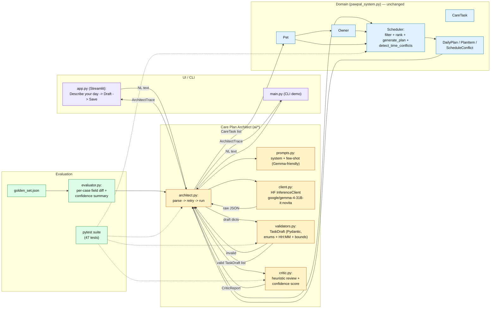
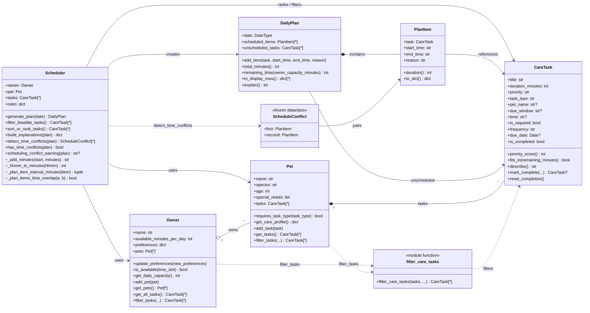

# PawPal+ system architecture

This file documents the system at two levels:

1. **Applied-AI architecture** — the full capstone system: natural-language intake
   through the Care Plan Architect, into the unchanged core scheduler, through
   the critic, and out to the UI / CLI. Matches what is actually implemented in
   `ai/*` + `pawpal_system.py` + `app.py` + `main.py`.
2. **Class model (UML)** — the class-level view of `pawpal_system.py` carried
   over from the Module 2 base project. No core classes were modified for the
   capstone; every class and relationship below is still current.

The Mermaid source for the applied-AI flowchart is also saved as
`assets/architecture.mmd` so it can be rendered to PNG.

## 1. Applied-AI architecture (data flow)

### How to read this diagram

- **Purple (UI / CLI)** and **blue (core)** existed before the capstone. Blue is
  frozen — `pawpal_system.py` was not touched.
- **Amber (Care Plan Architect)** is the new AI layer. It sits *in front of* the
  scheduler: free-text goes in, `CareTask` objects come out, and the existing
  `Scheduler.generate_plan` runs exactly as it always has.
- **Green (Evaluation)** is the reliability layer: the golden set exercises the
  architect end-to-end, and the pytest suite unit-tests validators, critic, and
  scheduler. Dotted arrows are "tests target this module."
- The `VA -- invalid --> AR` edge is the repair-retry loop: Pydantic rejects
  malformed drafts before any `CareTask` is constructed.

## 2. Class model (UML)

### What changed from the initial sketch

| Area | Earlier diagram | Final code |
|------|-----------------|------------|
| **Pet** | No `tasks` list or task APIs | `Pet` holds `CareTask` instances via `add_task` / `get_tasks` / `filter_tasks` |
| **Owner** | Basic fields only | Adds `get_pets`, `get_all_tasks` (union across pets), and `filter_tasks` |
| **CareTask** | Partial fields | Adds `time`, `frequency`, `due_date`, `is_completed`, `mark_complete`, `reset_completion` |
| **Scheduler** | Core plan + filter + sort | Adds conflict detection (`detect_time_conflicts`, `has_time_conflicts`, `scheduling_conflict_warning`) and private time/interval helpers |
| **New type** | — | `ScheduleConflict` pairs overlapping `PlanItem`s for validation / UI warnings |
| **Module** | — | `filter_care_tasks` is a shared function used by `Owner.filter_tasks` and `Pet.filter_tasks` |

### Class diagram (Mermaid)

_Sorting uses module helper `_task_time_sort_key` (not shown) inside `sort_or_rank_tasks`._

### Export

The same UML diagram source is saved as `uml_final.mmd` for CLI rendering; the
rendered image is `images/uml_final.png`. The applied-AI flowchart source is in
`assets/care-plan-architect.png`.
